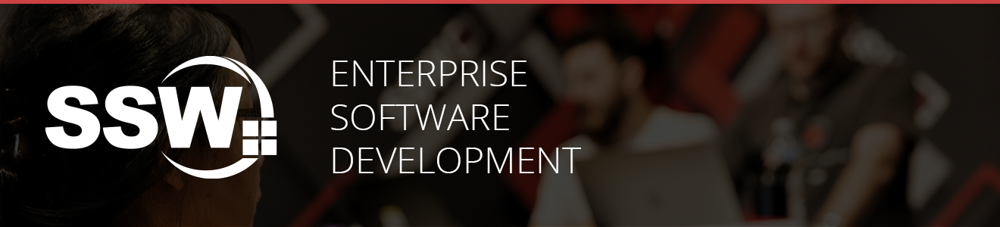

 

# SSW.SophieBot

An Enterprise People Bot.

# Introduction

SSW.SophieBot is an Enterprise People Bot build with Bot Framework Composer.

# Getting Started

1. [Run bot with Bot Framework Composer](_docs/Instructions-Compile.md)
2. [Deploy the bot](_docs/Instructions-Deployment.md)

# Contribute

Contributions to SSW.SophieBot are welcome. Here is how you can contribute to SSW.SophieBot:

-   [Submit bugs](https://github.com/SSWConsulting/SSW.SophieBot/issues) and help us verify fixes.
-   [Submit pull requests](https://github.com/SSWConsulting/SSW.SophieBot/pulls) for bug fixes and features and discuss existing proposals

# License

[MIT License](LICENSE)
