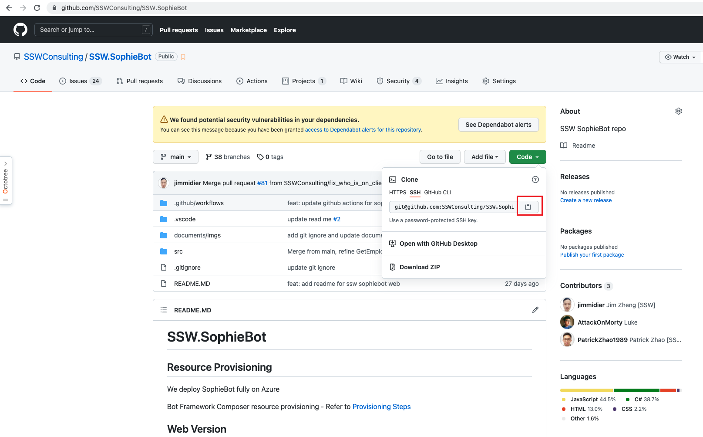
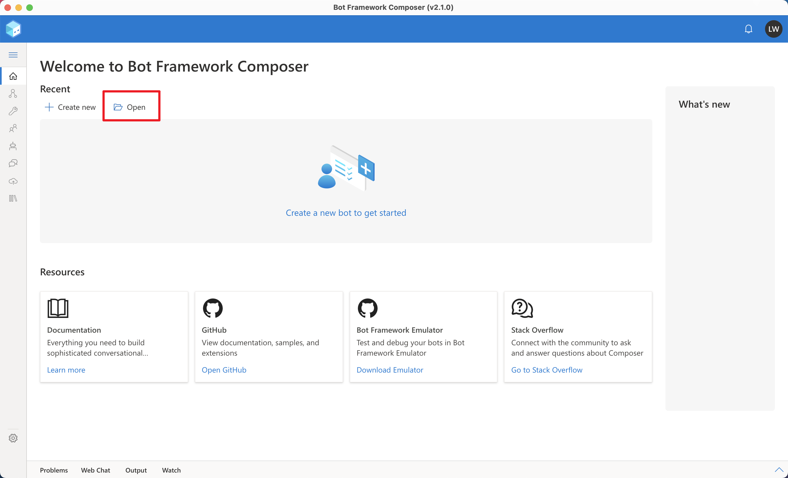
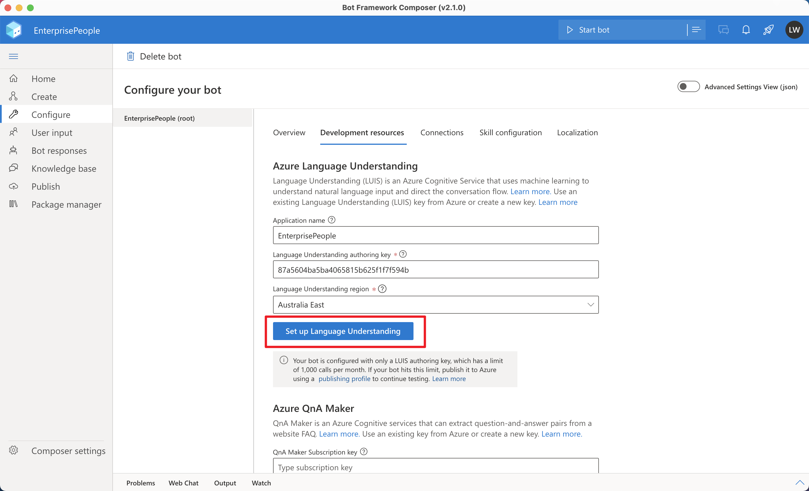
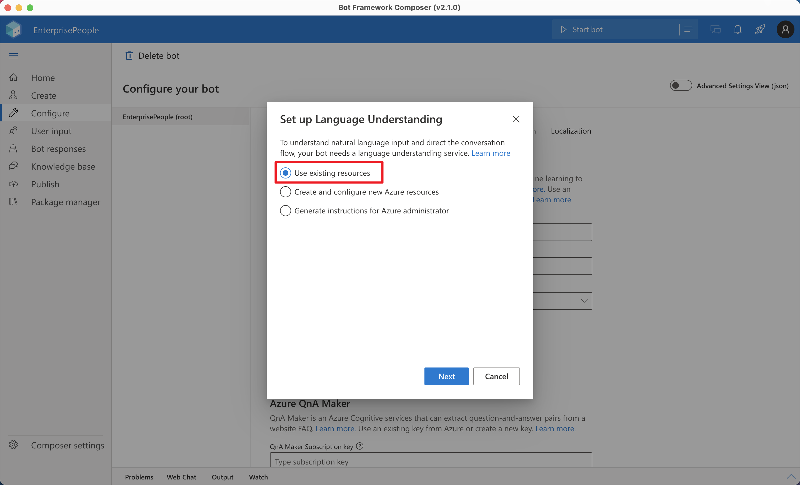
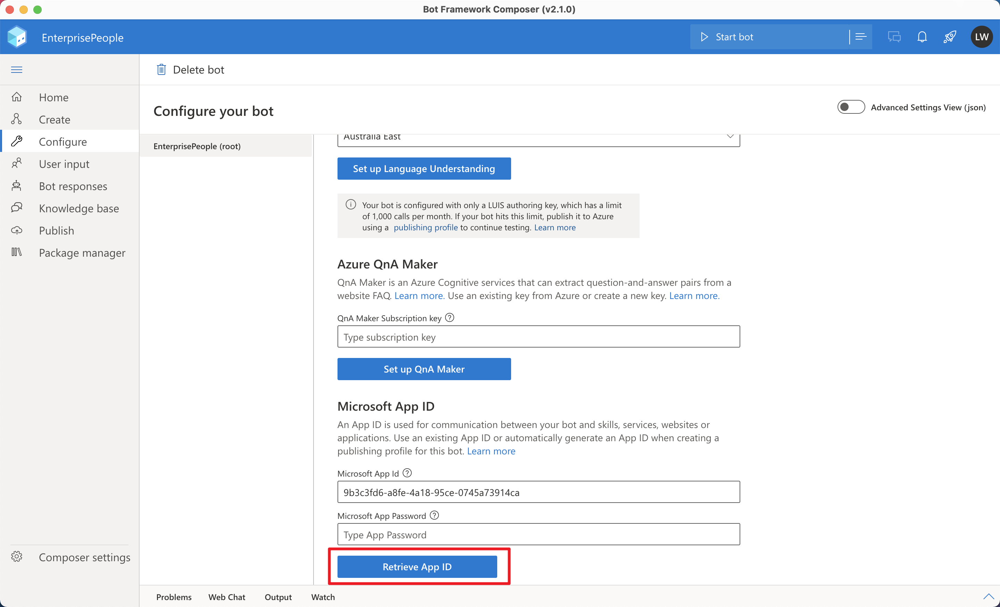
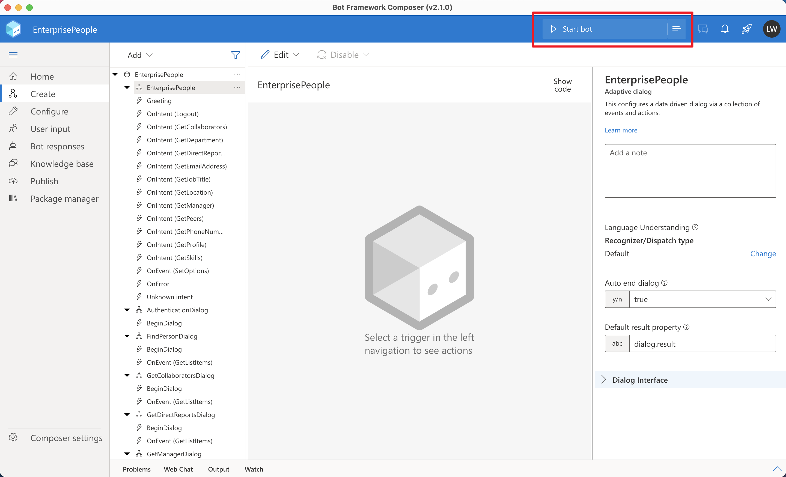
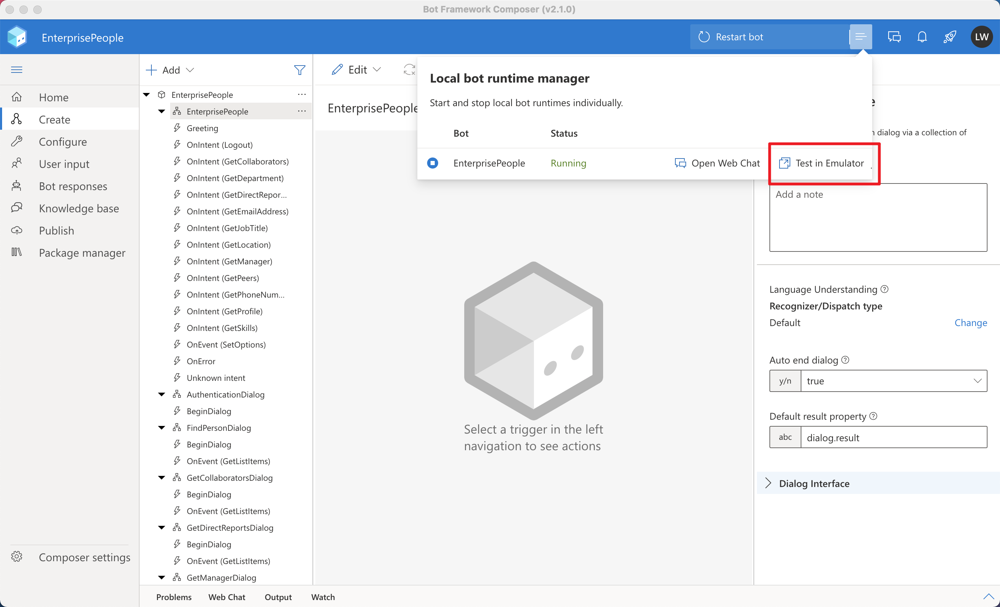
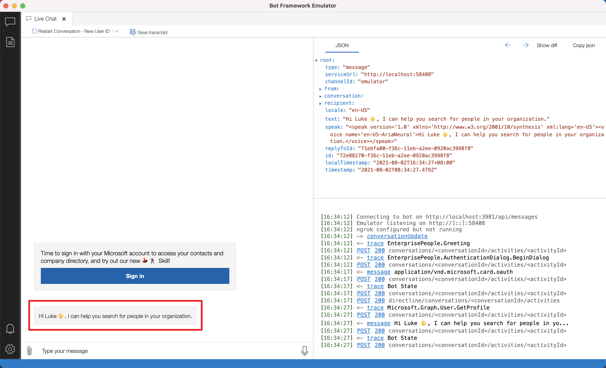

# Run with Bot Framework Composer

## Prerequisites

In order to get set up to work with SSW.SophieBot, you will need the following:

1. [Bot Framework Composer](https://docs.microsoft.com/en-us/composer/install-composer?tabs=macos)
2. [Bot Framework Emulator](https://github.com/Microsoft/BotFramework-Emulator/blob/master/README.md)
3. [Installing & Configuring ngrok](<https://github.com/Microsoft/BotFramework-Emulator/wiki/Tunneling-(ngrok)>)
4. [Azure Resources](https://github.com/SSWConsulting/SSW.SophieBot.Private/blob/main/Instruction-Azure-Resources.md#azure-resources)

## Initial Setup

1. [Clone the repo](#step-1-clone-the-repo)
2. [Create App Settings](#step-2-create-appsettingsjson)
3. [Open the repo with Composer](#step-2-open-the-repo-with-composer)
4. [Configure your bot](#step-3-configure-your-bot)
5. [Test run](#step-4-test-run)

### Step 1. Clone the repo

Go to [SSW.SophieBot](https://github.com/SSWConsulting/SSW.SophieBot) and clone the repo.

**Figure: Click Copy to get download link**

### Step 2. Create appsettings.json

1. From the cloned repo, go to "{your cloned repo}/bots/employee-finder/src/SSW.SophieBot/settings" folder
2. Make a copy of the file `appsettings.example.json` and rename it to `appsettings.json`.
3. Add necessary configurations to `appsettings.json`.
   > Note: For `adapters` and `components` sections in `runtimeSettings`, do not modify the initial settings from `appsettings.example.json` as they are needed for the test run.

### Step 3. Open the repo with Composer

Open the Bot Framework Composer.

> You can find GitHub repository for Bot Framework Composer [here](https://github.com/microsoft/BotFramework-Composer)

**Figure: Click Open on Composer's homepage**

### Step 4. Configure your bot

In Bot Framework Composer, go to Configure | Development resources.

1. Set up Language Understanding.

**Figure: Click Set up Language Understanding**

**Figure: Select Use existing resources and click next**

**Figure: Select the subscription and luis resource and click next**

2. Set up App ID. Still in the Configure | Development resources, scroll to the bottom.

**Figure: Click Retrieve App ID**

**Figure: Select publishing profile**

### Step 5. Test run

**Figure: Click Start bot**

**Figure: Click Test in Emulator**

> You can find GitHub repository for Bot Framework Emulator [here](https://github.com/microsoft/BotFramework-Emulator)

**Figure: Get welcome message**
