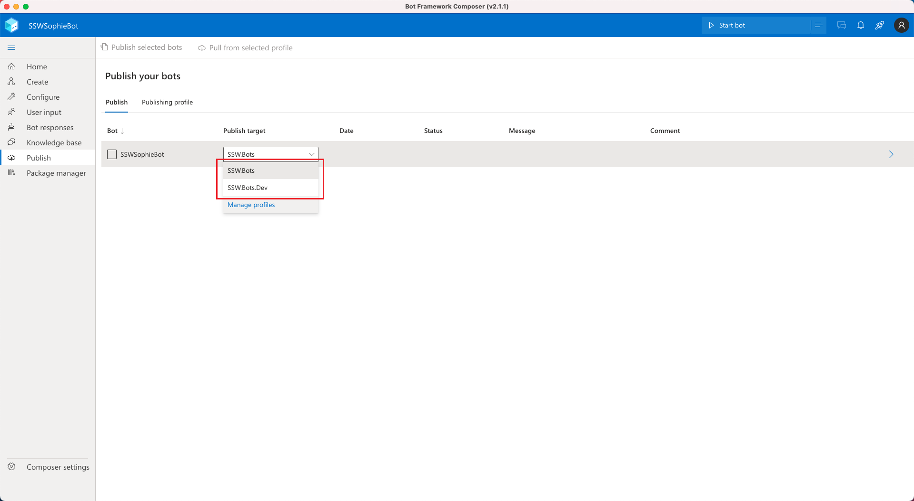
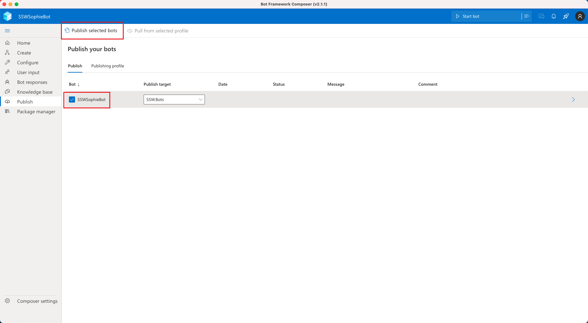

# Deployment

-   [Deploy with Bot Framework Composer](#deploy-with-bot-framework-composer)
-   [Automatic deployment with GitHub Actions](#automatic-deployment-with-github-actions)

## Deploy with Bot Framework Composer

1. Open the repo with Bot Framework Composer.

2. Go to **Publish** section, select the publishing file.
   
   **Figure: Choose the publishing file**

3. Check the bot you want to publish. Click **Publish selected bots**.
   
   **Figure: Publish the bot**

## Automatic deployment with GitHub Actions

Only for dev bot, it will automatically trigger deployment after changes are pushed to the main branch. Please refer to [SSW.SophieBot.dev.yml](https://github.com/SSWConsulting/SSW.SophieBot/blob/main/.github/workflows/SSW.SophieBot.dev.yml)
