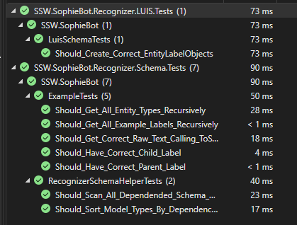
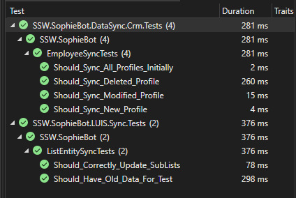
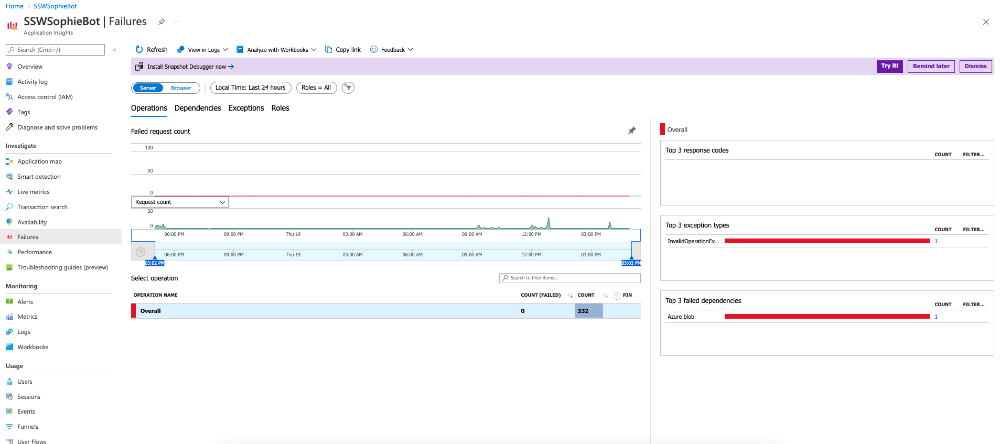
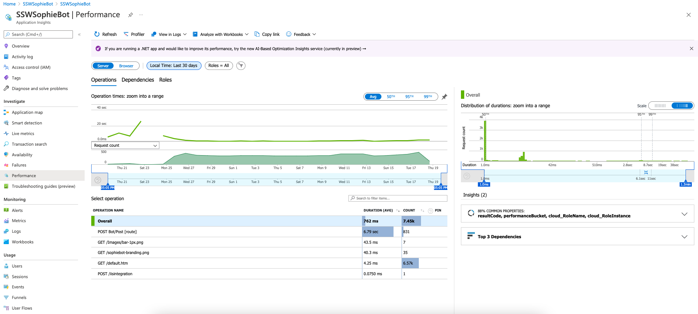

Before starting any work, you should ensure developers take a look at your Application Insights data to make sure everything is performing correctly. Please do followings:

1. Check Unit Tests are Green.

   - In Visual Studio, You need to open two solutions to run the test.
   - Go to **./libraries/test and open SSW.SophieBot.sln** and run the test under the test folder.  
        
      **Figure:** Make sure all test runs are green for libraries.

   - Go to **./services/test and open SSW.SophieBot.services.sln** and run the test under the test folder.  
        
      **Figure:** Make sure all test runs are green for services.

2. Look for any new Unhandled Exceptions in App Insights.

**Figure:** You can monitor failed requests in [Application Insights](https://portal.azure.com/#@sswcom.onmicrosoft.com/resource/subscriptions/b8b18dcf-d83b-47e2-9886-00c2e983629e/resourceGroups/SSW.SophieBot/providers/Microsoft.Insights/components/SSWSophieBot/performance)

3. Look for any obvious performance issues (Server then client).

  
**Figure:** You can monitor the performance in [Application Insights](https://portal.azure.com/#@sswcom.onmicrosoft.com/resource/subscriptions/b8b18dcf-d83b-47e2-9886-00c2e983629e/resourceGroups/SSW.SophieBot/providers/Microsoft.Insights/components/SSWSophieBot/performance)
