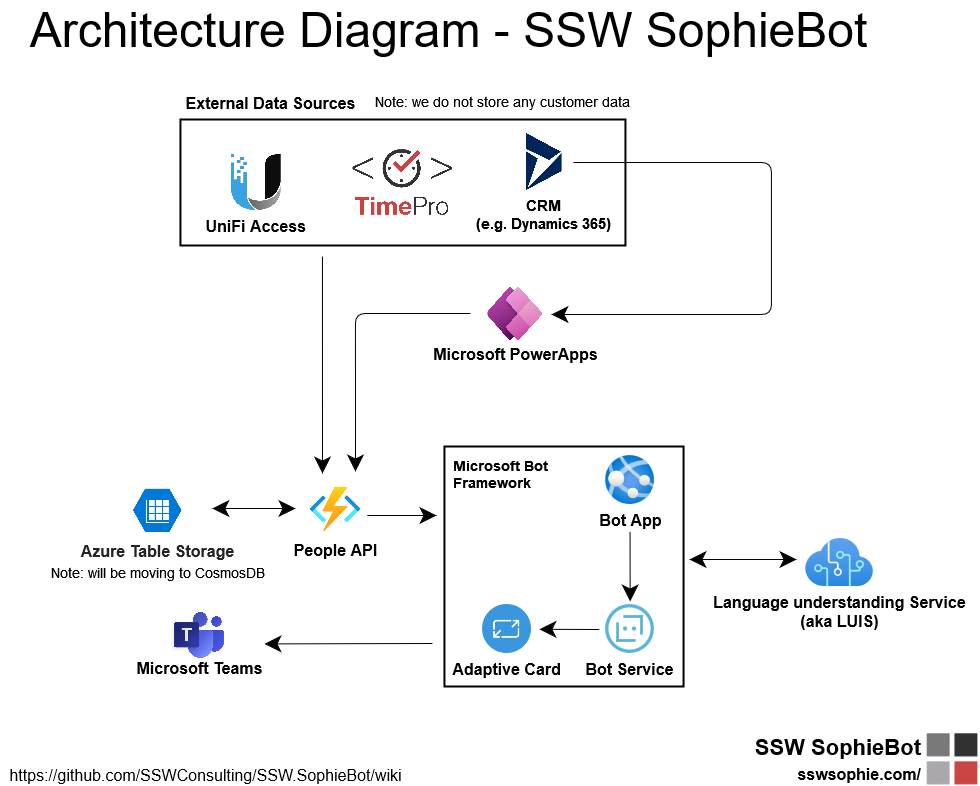

# **Technologies in SophieBot**
Architecture Overview:
  
**Figure: Diagram of SophieBot and components**

## **LUIS**
[Language Understanding Services(LUIS)](https://learn.microsoft.com/en-us/azure/cognitive-services/luis/) is used as the NLP service for SophieBot.

> ⚠️Note: LUIS is being deprecated and replaced by [Azure Cognitive Service for Language documentation](https://learn.microsoft.com/en-us/azure/cognitive-services/language-service/concepts/migrate)

## **Channels**
SophieBot is currently only connected to MS Teams through [Azure Bot Service](https://learn.microsoft.com/en-us/azure/bot-service/channel-connect-teams?view=azure-bot-service-4.0). More channels can be configured in the same way without much efforts, but there's no plan of doing so for now.

## **People API**
SophieBot fetches data from a centralized data source called `People API`, which is an Azure Function app maintained internally by SSW.

In general what `People API` does is to periodically load and extract data from multiple sources (e.g. Microsoft Dataverse), stores the data into Azure Table Storage, and expose REST APIs to serve query requests.

For any issues or feedback regarding `People API` please [raise a GitHub issue](https://github.com/SSWConsulting/SSW.SophieBot/issues/new/choose).

## **Microsoft PowerApps**
[PowerApps](https://learn.microsoft.com/en-us/power-apps/powerapps-overview) is used to listen for certain data sources, and process data changes.
