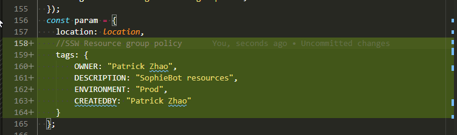

# This directory is downloaded from [Microsoft GitHub Repository](https://github.com/microsoft/BotFramework-Composer/tree/main/Provisioning)
We updated the provisionComposer.js to include some SSW policy related setting


### We need following services


| Resource                                      
| --------------------------------------------- |
| App Service plan                              |
| App Service                                   |
| Application Registration                      |
| Azure Cosmos DB                               |
| Application Insights                          |
| Azure Blob Storage                            |
| LUIS authoring resource (Cognitive Services)  |
| LUIS prediction resource (Cognitive Services) |


1. Run
```shell
npm install
```

2. Run
```shell
node provisionComposer.js --subscriptionId=<YOUR AZURE SUBSCRIPTION ID> --name=<NAME FOR YOUR RESOURCES> --appPassword=<APP PASSWORD> --environment=<NAME FOR ENVIRONMENT DEFAULT to dev> --location australiaeast --createQnAResource=false --resourceGroup=<NAME FOR YOUR RESOURCE GROUP>
```

